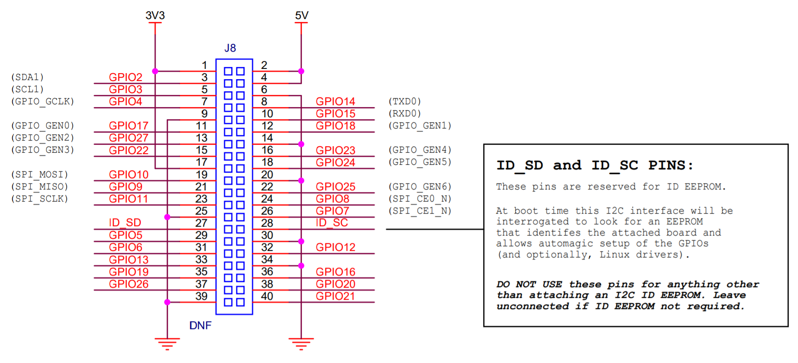

# README

树莓派应该算是目前开源硬件里学习嵌入式Linux系统最好的工具，里面的设计思路和一些工具是很值得借鉴的，这里主要使用Raspberry Pi ZERO W进行系统架构分析。

之前在使用树莓派的过程中有记录一些东西，不过没有进行全面系统性的分析，相对比较零散。

[博客园 - 随笔分类 - Raspberry Pi](https://www.cnblogs.com/zengjfgit/category/783268.html)

## ZERO W接口原理图

## 参考文档

* [Raspberry Pi](https://www.raspberrypi.org/)
* [Raspberry Pi On GitHub](https://github.com/raspberrypi)
* [Raspberry Pi Documentation](https://github.com/raspberrypi/documentation)
* [Raspberry Pi Pinout](https://pinout.xyz/pinout/uart)
* [systemd](https://github.com/systemd/systemd)

## 笔记文档

* [0019_Kernel_Build.md](docs/0019_Kernel_Build.md)
* [0018_Samba.md](docs/0018_Samba.md)
* [0017_Internationalisation_Options.md](docs/0017_Internationalisation_Options.md)
* [0016_Setup_Multiple_WiFi_Networks.md](docs/0016_Setup_Multiple_WiFi_Networks.md)
* [0015_Modify_Default_Route.md](docs/0015_Modify_Default_Route.md)
* [0014_Ethernet_over_USB-Static_IP.md](docs/0014_Ethernet_over_USB-Static_IP.md)
* [0013_dtoverlay.md](docs/0013_dtoverlay.md)
* [0012_Dynamic_Device_Tree.md](docs/0012_Dynamic_Device_Tree.md)
* [0011_SPI.md](docs/0011_SPI.md)
* [0010_I2C_AT24C0x.md](docs/0010_I2C_AT24C0x.md)
* [0009_systemd-sysv-generator.md](docs/0009_systemd-sysv-generator.md)
* [0008_Systemd_Advance.md](docs/0008_Systemd_Advance.md)
* [0007_Systemd_Cron_rc-local.md](docs/0007_Systemd_Cron_rc-local.md)
* [0006_Device_Tree_Overlays.md](docs/0006_Device_Tree_Overlays.md)
* [0005_raspi-config.md](docs/0005_raspi-config.md)
* [0004_Pin_Config.md](docs/0004_Pin_Config.md)
* [0003_BIOS.md](docs/0003_BIOS.md)
* [0002_Boot_Sequence.md](docs/0002_Boot_Sequence.md)
* [0001_OTG_To_Ethernet.md](docs/0001_OTG_To_Ethernet.md)
