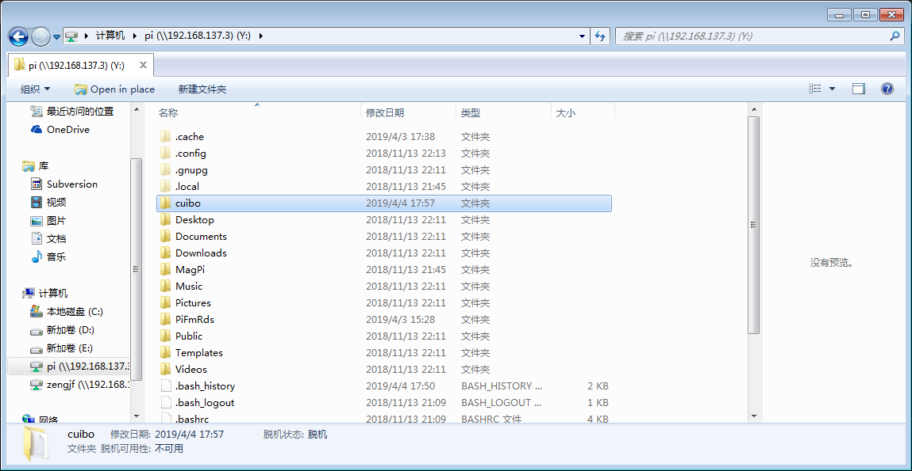

# Samba

## 参考文档

* [Create a NAS with your Raspberry Pi and Samba](https://howtoraspberrypi.com/create-a-nas-with-your-raspberry-pi-and-samba/)
* [smb.conf — The configuration file for the Samba suite](https://www.samba.org/samba/docs/current/man-html/smb.conf.5.html)

## 基本操作

* `sudo apt-get install samba samba-common-bin`
* `sudo smbpasswd -a pi`：输入pi用户的samba访问密码
* `sudo vim /etc/samba/smb.conf`
  ```
  [...省略]
  [homes]
     comment = Home Directories
     browseable = no
  
  # By default, the home directories are exported read-only. Change the
  # next parameter to 'no' if you want to be able to write to them.
     read only = no                         # <-- 如果需要可读可写，改为no
  
  # File creation mask is set to 0700 for security reasons. If you want to
  # create files with group=rw permissions, set next parameter to 0775.
     create mask = 0700
  [...省略]
  ```
* `sudo systemctl restart smbd.service nmbd.service`
  ```
  root@raspberrypi:/etc/samba# ps aux | grep smb
  root       526  0.0  3.1  40716 13948 ?        Ss   10:58   0:00 /usr/sbin/smbd
  root       530  0.0  1.2  38700  5524 ?        S    10:58   0:00 /usr/sbin/smbd
  root       531  0.0  1.1  38712  4980 ?        S    10:58   0:00 /usr/sbin/smbd
  root       544  0.0  1.2  40704  5464 ?        S    10:58   0:00 /usr/sbin/smbd
  root       730  0.1  3.1  41124 14016 ?        S    10:59   0:00 /usr/sbin/smbd
  root       818  0.0  0.4   4364  1964 pts/0    S+   11:07   0:00 grep smb
  ```
* windows下网上邻居->右键->映射网络驱动器，输入文件夹框`\\<your ip address>\pi`,按提示输入用户名密码即可。
  
* 多用户访问设定，仅仅单用户访问无需这一步设定：
  ```
  [...省略]
  # (重要)去掉一行：security = user，然后在配置文件末尾添加，树莓派中没有这个设定
  [zengjf]                              # windows访问\\server\share中的share字段
          path = /home/zengjf           # 指定家目录
          writeable = yes               # 是否可写
          browseable = yes              # 是否可查看
          valid users = zengjf          # 可访问用户，主要是多用户访问问题
  ```
